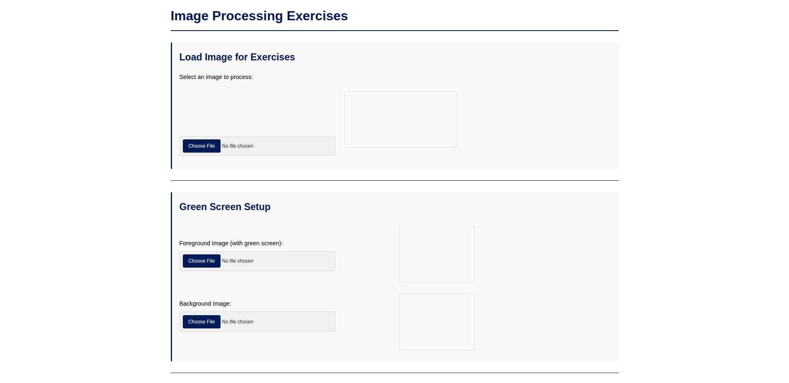
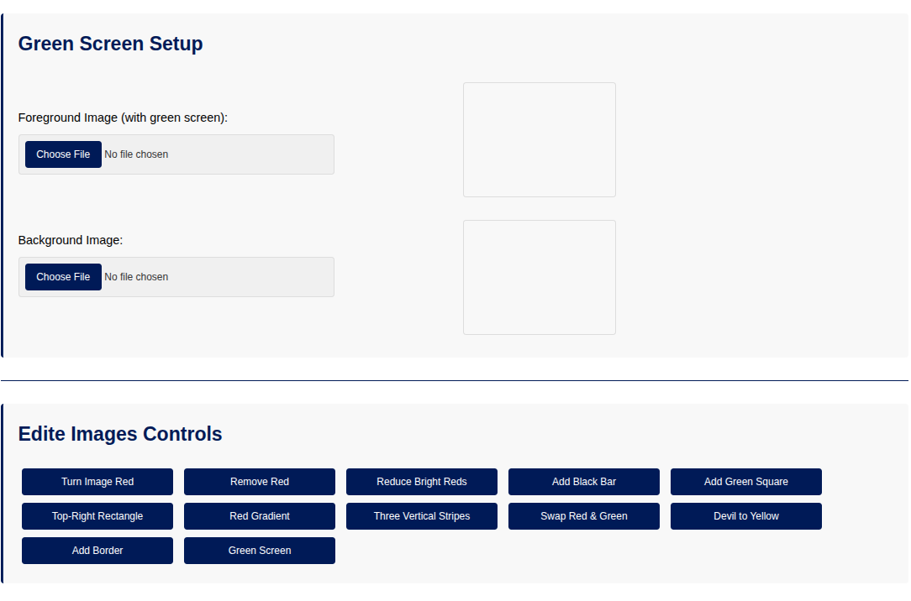
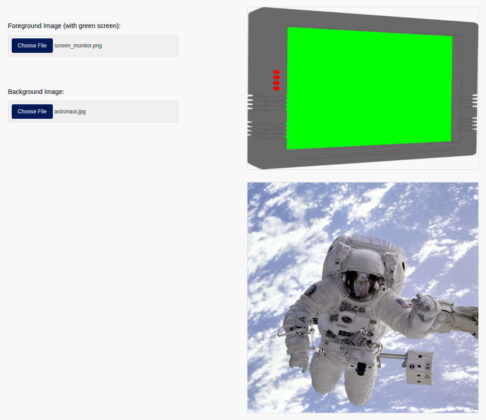
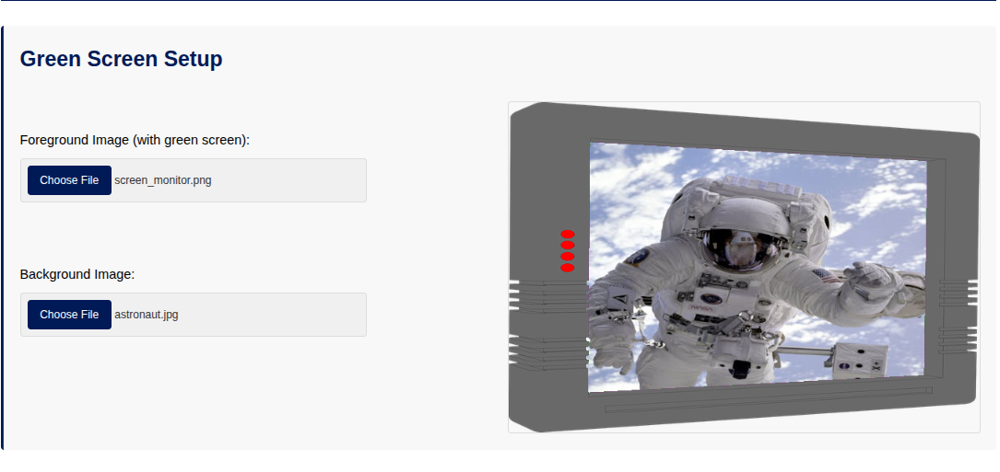
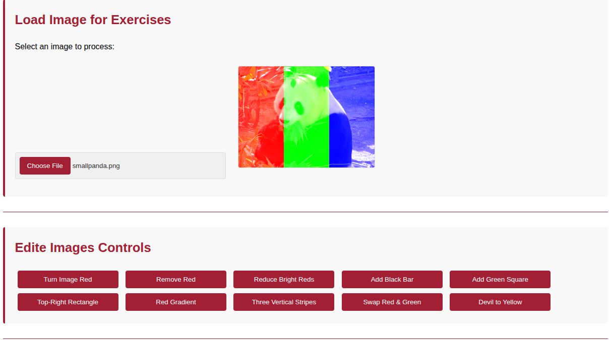
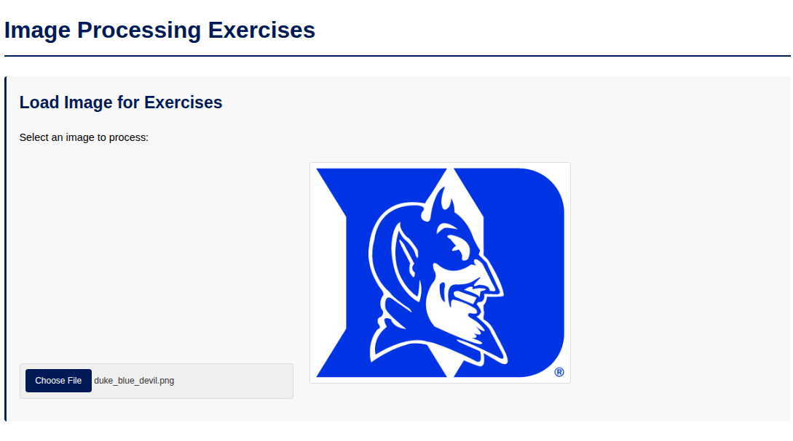
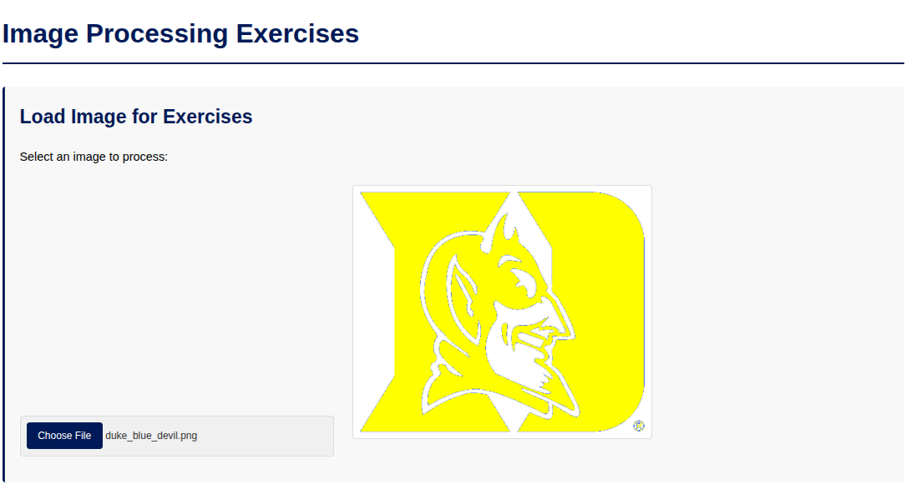

# JS Image Processing Exercises

This project is a web application for practicing and demonstrating various image manipulation techniques using JavaScript. It's built upon exercises from Duke University's "Programming Foundations with JavaScript, HTML and CSS" course. Users can upload their own images and apply a range of filters and effects, including a green screen feature. The application interface is styled with Duke University's signature blue and white colors.

## Technologies Used

*   HTML5
*   CSS3 (Styled with a Duke University-inspired color palette)
*   JavaScript (Utilizing ES6 Modules for code organization)
*   `SimpleImage.js` and `cs101.js` (Duke University libraries for simplified image processing)

## Main Features

*   **Flexible Image Loading:**
    *   Load a single image for most filter applications.
    *   Dedicated interface to load separate foreground (with green background) and background images for the green screen effect.
*   **Live Image Previews:** Loaded images for green screen are displayed on preview canvases.
*   **Canvas-Based Image Display:** All processed images are rendered onto HTML5 canvas elements.
*   **Variety of Image Filters and Modifications:**
    *   **Turn Image Red:** Maximizes the red channel of every pixel.
    *   **Remove Red:** Sets the red channel of every pixel to 0.
    *   **Reduce Bright Reds:** Caps the red channel intensity at a specific value (e.g., 70).
    *   **Add Black Bar:** Adds a 10-pixel thick black bar to the bottom of the image.
    *   **Add Green Square:** Draws a 50x50 green square in the top-left corner.
    *   **Top-Right Rectangle:** Allows drawing a custom-colored rectangle of specified dimensions in the top-right corner.
    *   **Red Gradient:** Generates a new image displaying a horizontal red gradient.
    *   **Three Vertical Stripes:** Applies red, green, and blue dominant stripes to the left, middle, and right thirds of the image, respectively.
    *   **Swap Red & Green:** Swaps the red and green color channel values for every pixel.
    *   **Devil to Yellow:** Transforms a "Duke blue" colored subject (like the Blue Devil mascot) to yellow.
    *   **Add Border:** Adds a black border of a specified thickness around the image.
    *   **Green Screen Effect:** Replaces the green background of a foreground image with a background image of the user's choice.
*   **Modular JavaScript Code:** Well-organized code structure with ES6 modules separating concerns (DOM elements, state management, image processing logic, utility functions, and event handling).
*   **User-Friendly Interface:** A clean and intuitive layout with clearly labeled controls for each image processing task.

## Screenshots

**Main Application View (showing Duke-inspired colors and image loading):**


**Green Screen Setup Interface (loading foreground and background images):**


**Example of "Green Screen" Effect - Before:**


**Example of "Green Screen" Effect - After:**


**Example of the "Three Vertical Stripes" Filter:**


**Example of the "Devil to Yellow" Transformation:**
*Original Image:*


*Image After "Devil to Yellow" Filter:*


## How to Use

1.  **Get the Code:**
    *   You can download the project files as a ZIP.
    *   Or, if you have Git installed, clone the repository:
        ```bash
        git clone https://github.com/VladimirStarcevic/JS-ImageProcessing.git 
        ```
        
2.  **Navigate to the Project Folder:**
    *   Open your file explorer or terminal and go into the `JS-ImageProcessing` folder.
3.  **Open in Browser:**
    *   Find the `index.html` file and open it with your web browser (e.g., Chrome, Firefox, Edge).

You can now load images and experiment with the various image processing features!

---
*This project is based on and extends exercises from the Coursera course "Programming Foundations with JavaScript, HTML and CSS" by Duke University. The SimpleImage library provided by Duke University is used for image manipulation tasks.*
