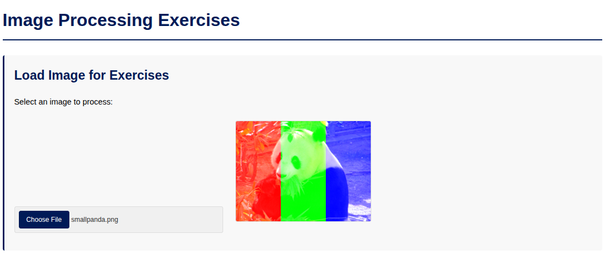

# JS Image Processing Exercises

This project is a collection of JavaScript exercises. It helps practice how to change images using code. The exercises focus on using loops, conditional statements (if/else), and the SimpleImage library from Duke University. You can load your own images and apply different effects to them.

## Technologies Used

*   HTML5
*   CSS3
*   JavaScript (using ES6 Modules for organization)
*   `SimpleImage.js` and `cs101.js` (special libraries from Duke University for image processing)

## Main Features

*   **Load Images:** You can choose an image from your computer to work with.
*   **Image Display:** The selected image is shown on a canvas element.
*   **Various Image Filters and Modifications:**
    *   **Turn Image Red:** Makes the red color in every pixel as strong as possible.
    *   **Remove Red:** Removes all red color from the image.
    *   **Reduce Bright Reds:** Lowers the intensity of very bright red colors.
    *   **Add Black Bar:** Puts a black bar at the bottom of the image.
    *   **Add Green Square:** Draws a green square in the top-left corner of the image.
    *   **Top-Right Rectangle:** Lets you draw a rectangle of any color and size in the top-right corner (example in code uses a yellow rectangle).
    *   **Red Gradient:** Creates a new image showing a smooth change from black to red.
    *   **Three Vertical Stripes:** Divides the image into three vertical parts. The left part gets more red, the middle part more green, and the right part more blue.
    *   **Swap Red & Green:** Swaps the red and green color values for every pixel.
    *   **Devil to Yellow:** Changes specific blue parts of an image (like the Duke Blue Devil logo) to yellow.
*   **Organized Code:** The JavaScript code is organized into modules for better structure.
*   **User Interface:** The page has a clear layout with buttons to try each effect.

## Screenshots

Here is what the application looks like:

**Main Application View (after loading an image):**


**Example of the "Three Vertical Stripes" Filter:**


**Example of the "Devil to Yellow" Transformation:**
*Original Image:*


*Image After "Devil to Yellow" Filter:*


## How to Use

1.  **Get the Code:**
    *   You can download the project files.
    *   Or, if you have Git, clone the repository: 
        ```bash
        git clone https://github.com/VladimirStarcevic/JS-ImageProcessing.git
        ```
2.  **Go to the Project Folder:**
    *   Open your file explorer or terminal and go into the `JS-ImageProcessing` folder.
3.  **Open in Browser:**
    *   Find the `index.html` file and open it with your favorite web browser (like Chrome, Firefox, etc.).

Now you can load images and try out the different processing effects!

---
*This project includes exercises from a Coursera course by Duke University ("Programming Foundations with JavaScript, HTML and CSS").*